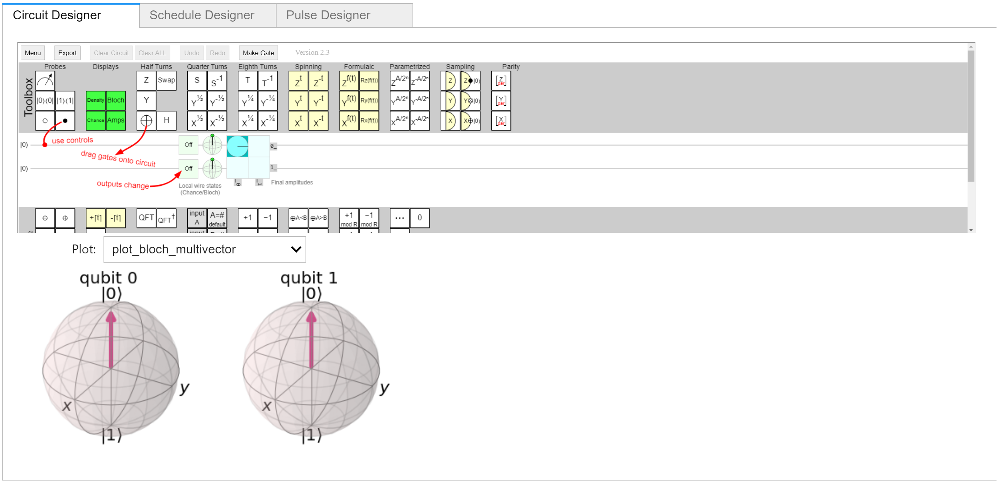

# Qonduit
[](https://pypi.org/project/qonduit/)

An open-source Python widget library and dashboard workflow for quantum computing that utilizes the best of what’s available. Our hope is that this package can go wherever you or your projects go, enabling you to:
- Learn more about quantum computing
- Work with circuits and/or pulse-level control
- Switch between any quantum computing framework while still having consistent visualization support
- Build custom dashboards based on what is needed for your experiments / research 
 
It utilizes a novel UI for pulse-level control, [pulsemaker](https://github.com/adgt/pulsemaker), but can support other pulse-level control UIs as long as they are Jupyter widgets.

Currently, there is support for Qiskit and Cirq. We hope to support more quantum computing integrations based on what is requested by the community.



## Getting Started
### Installation

To install use pip (JupyterLab 3 recommended):

    $ pip install qonduit

For a development installation,

    $ git clone https://github.com/adgt/qonduit.git
    $ cd pyQuirk
    $ pip install -e .


Additionally, you need Qiskit or Cirq installed and the following if you wish to make use of the Dashboards feature:
- [pyQuirk](https://github.com/adgt/pyQuirk#installation)
- [pulsemaker](https://github.com/adgt/pulsemaker#installation)

### Example

Take a look at [example.ipynb](example.ipynb) for a simple example.

Otherwise, you can simply run (assumes Qiskit is installed):
```python
from qonduit.dashboard import Default
from qiskit import QuantumCircuit
Default(QuantumCircuit(2))
```

If you have `pyQuirk` [installed](https://github.com/adgt/pyQuirk#installation), then the Circuit Designer will show up with an interactive widget.

If you have `pulsemaker` [installed](https://github.com/adgt/pulsemaker#installation), then you can make use of the Schedule Designer and Pulse Designer tabs, too. There are [tutorials](https://github.com/adgt/pulsemaker#tutorials) for each of those.

### API

qonduit.visualization.circuit
- `design(circuit)`: widget for designing a circuit
- `draw(circuit)`: draw a circuit

qonduit.visualization.metrics
- `plot_histogram(data)`: plot a histogram with results from circuit execution/simulation

qonduit.visualization.pulse
- `design_schedule()`: widget for designing a pulse schedule
- `design_pulse()`: widget for designing a pulse waveform
- `plot_pulse_schedule(phases, freqs, pulses, samples)`: plot a pulse schedule

qonduit.visualization.state
- `plot_bloch_multivector(state)`: plot a quantum state on bloch spheres
- `plot_state_city(state)`: plot the state city for a quantum state
- `plot_state_hinton(state)`: show a hinton plot for a quantum state
- `plot_state_paulivec(state)`: plot a bargraph of the mixed state rho over the pauli matrices
- `plot_state_qsphere(state)`: plot a quantum state using a qsphere (Qiskit-only)

qonduit.dashboard
- `Circuit(circuit)`: A circuit designer dashboard
- `Default`: The default dashboard that includes a circuit designer, pulse schedule designer, and a pulse designer

## Development

Follow the instructions above for a development installation. Then, to actively developing on your machine, run Jupyter Lab with the command:

    $ jupyter lab

Library files are located under the [qonduit](qonduit) folder. If you are doing work in JupyterLab or notebooks, then it is recommended to use the following for auto-reloading changes to the Python files:

```
%load_ext autoreload
%autoreload 2
```

### Software Architecture Design

Quantum computing is still in an experimental stage and as such tools such as Jupyter Lab / Notebooks are used for performing experiments and communicating to / educating others. There are wide discrepancies between what visualizations a quantum platform provides out-of-the-box with some being text-based (e.g. Cirq), others being static visuals (Qiskit), and some even being interactive. As new visualization / tool needs are required, such as pulse visualizations, many quantum platforms will need these tools. Perhaps some of the platform teams will build them or maybe they won’t and only provide programmatic, API level access. Ideally, a developer would be able to use our library with any backend and have a full suite of visualization and metric tools regardless of whether the quantum platform has any built-in support.

Qonduit was built with reliance on ["duck typing"](https://en.wikipedia.org/wiki/Duck_typing) in Python. The idea is that you can have optional dependencies that, if installed, may get used based on a priority list we are defining in code. Eventually, this could be something customizable with a settings configuration. When an API call is made to qonduit, then it will try the first package in the priority list to service the API request. If it is not installed, then it falls back to the next one and so on. There's the possibility to provide default implementations, too, in qonduit, but that hasn't been a priority. A "backend" is defined as a layer that services any subset of the API that exists. Examples are located in the [_backend](qonduit/_backend/) folder.